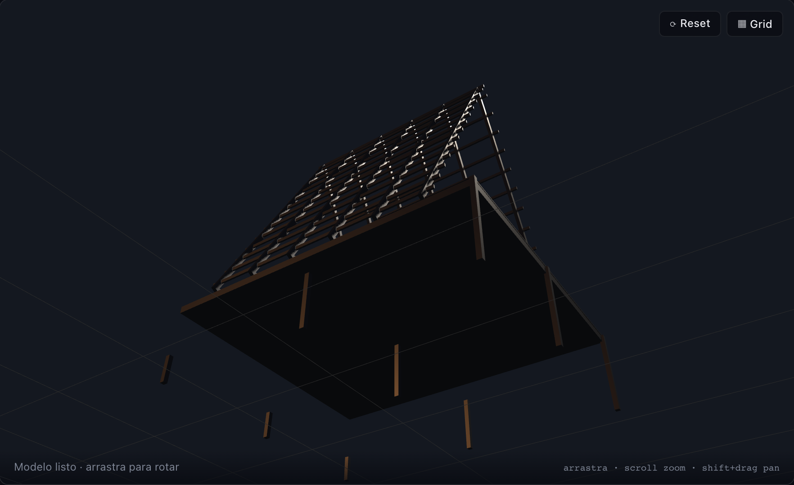
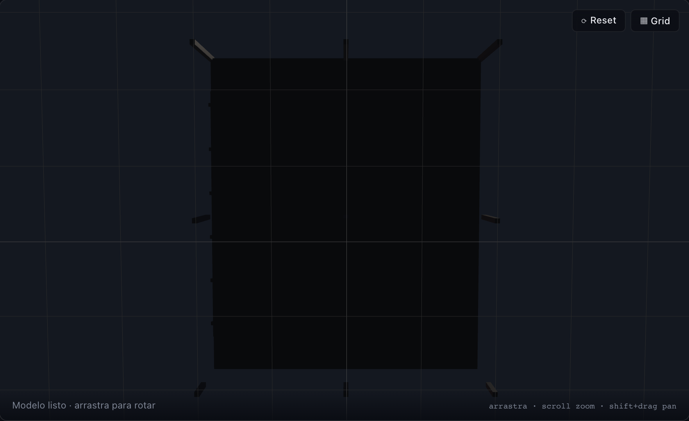
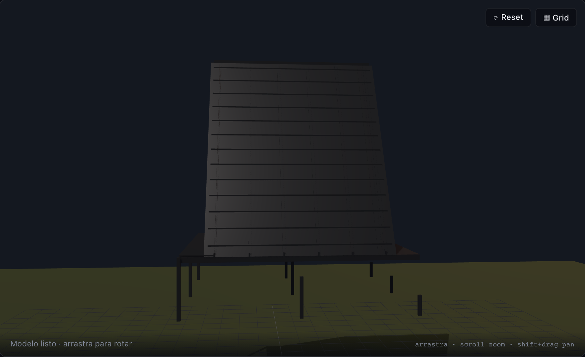
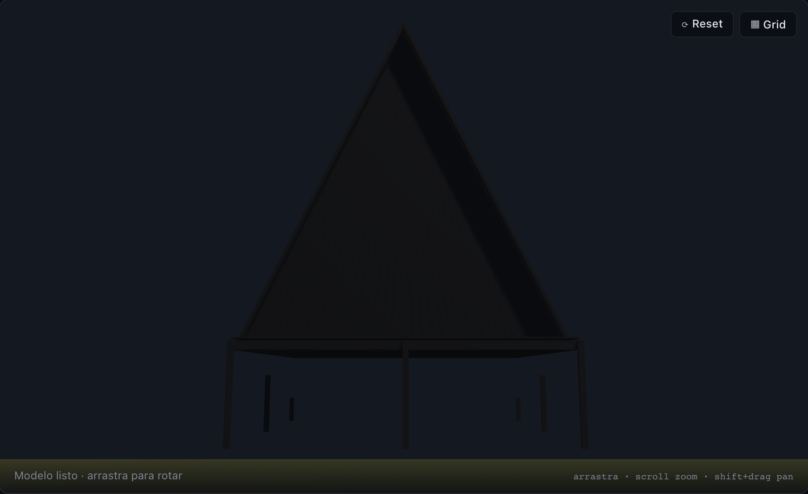
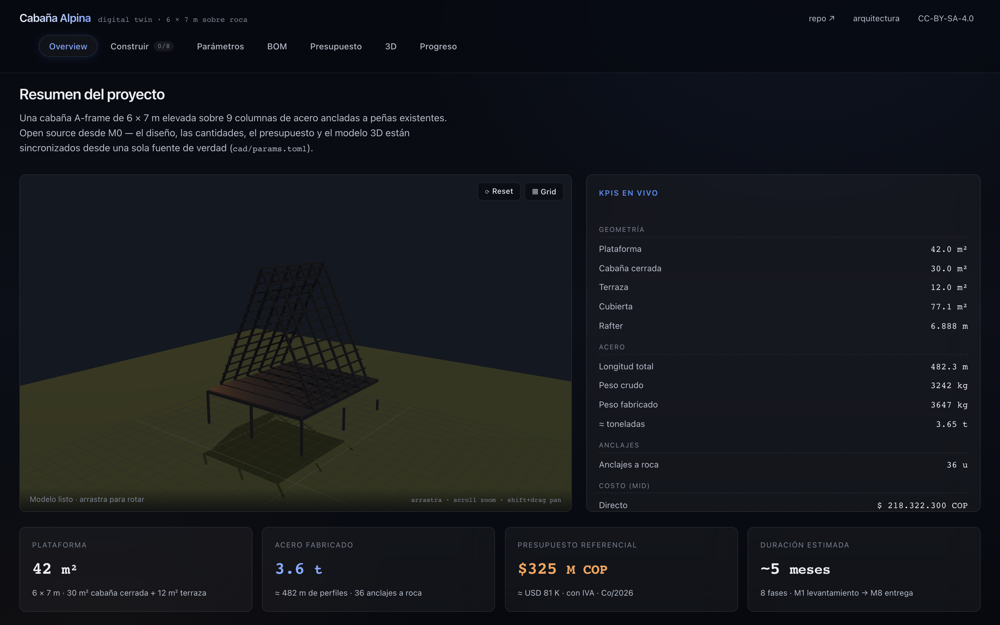

# Cabaña Alpina — Construcción Open Source

Cabaña tipo A-frame de 6 × 7 m elevada sobre plataforma de acero, apoyada en peñas de roca existentes. Liberada en open source desde M0 para que cualquiera pueda hacer fork del diseño, del listado de materiales y de la bitácora de obra.

**🌐 Página interactiva**: **<https://broomva.github.io/alpine-cabin/>** · 📐 STEP/STL en [`cad/exports/`](cad/exports/) · 📄 [README in English](README.en.md)


## Modelo 3D paramétrico

Generado con [build123d](https://github.com/gumyr/build123d) desde [`cad/params.toml`](cad/params.toml). Las 4 vistas se regeneran automáticamente con `make render`.

| | | |
|---|---|---|
|  |  | |
| Vista isométrica | Vista frontal — gable de vidrio | |
|  |  | |
| Vista lateral — pórticos A-frame | Vista cenital | |

## Estado

**M0.4 — Digital twin paramétrico + governance OSS.** `cad/params.toml` es fuente única de verdad. El BOM, el modelo CAD (STEP/STL/GLTF) y la página interactiva derivan automáticamente. Las dimensiones siguen siendo **preliminares** — perfiles, anclajes, soldaduras y arriostramientos finales deben ser validados por un ingeniero estructural matriculado, después de un estudio geotécnico del sitio.

[](https://github.com/broomva/alpine-cabin/actions/workflows/validate.yml)
[](https://broomva.github.io/alpine-cabin/)
[](LICENSE)

### Página interactiva

La página tiene 7 tabs con el diseño completo: overview, guía de construcción paso a paso (140+ sub-pasos), parámetros editables en vivo, BOM, presupuesto, viewer 3D y un asistente de progreso que guarda checkpoints en `localStorage`.


*Tab Overview — viewer 3D + KPIs en vivo + summary cards*

## Qué hay en este repo

| Archivo | Propósito |
|---|---|
| [`SPEC.md`](SPEC.md) | Especificación dimensional + sistema (plataforma, A-frame, envolvente) |
| [`BOM.md`](BOM.md) | Listado de materiales — **auto-generado** desde `cad/params.toml` |
| [`PRESUPUESTO.md`](PRESUPUESTO.md) | Presupuesto referencial Co/2026 — BOM con precios, mano de obra, indirectos, IVA, total |
| [`ARCHITECTURE.md`](ARCHITECTURE.md) | Arquitectura del **digital twin** — pipeline params → BOM/CAD/HTML + decisiones |
| [`cad/params.toml`](cad/params.toml) | **Fuente única de verdad** — geometría, perfiles, alturas de columna |
| [`cad/prices.toml`](cad/prices.toml) | **Fuente única de verdad** — precios Co/2026 |
| [`cad/cabin.py`](cad/cabin.py) | Modelo paramétrico build123d → STEP + STL + GLB |
| [`web/index.html`](web/index.html) | Página interactiva — viewer 3D + sliders + KPIs en vivo |
| [`docs/SITE.md`](docs/SITE.md) | Contexto del sitio — terreno, peñas de roca, vegetación, pendiente |
| [`docs/REFERENCE.md`](docs/REFERENCE.md) | Intención de diseño + decisiones críticas para el ingeniero |
| [`docs/NOTES.md`](docs/NOTES.md) | Preguntas abiertas, bitácora de decisiones, hitos |
| [`assets/reference/`](assets/reference/) | Foto cabaña de referencia, foto del sitio, infografía del sistema |

## Cómo correr el digital twin localmente

```bash
make setup     # crea venv + instala build123d + jinja2 (una vez)
make all       # regenera BOM + CAD + datos del HTML desde params.toml
make serve     # sirve la página en http://localhost:8765
make validate  # verifica que el GLB coincide con params.toml (regression test)
make render    # regenera los 4 PNG en assets/renders/
make dogfood   # Playwright recorre las 7 tabs y captura screenshots
```

Para experimentar:
1. Mueve los sliders en https://broomva.github.io/alpine-cabin/ (tab Parámetros).
2. Descarga el experimento como JSON (botón "Descargar experimento JSON").
3. Aplica el JSON al repo con `python cad/apply_experiment.py path/al/experimento.json` — esto actualiza `cad/params.toml`, regenera BOM/CAD/web data, y te sugiere el commit.
4. Push → la página live re-deploya con tu diseño.

Alternativa directa: edita `cad/params.toml` y corre `make all`.

Ver [`ARCHITECTURE.md`](ARCHITECTURE.md) para el diseño completo del sistema.

## Concepto

- **Huella**: plataforma elevada 6.0 × 7.0 m (42 m²)
- **Cabaña cerrada**: ~6.0 × 5.0 m (30 m²)
- **Terraza frontal**: 6.0 × 2.0 m (12 m²)
- **Cubierta**: A-frame, ápice ~6.2 m, lámina metálica negra tipo standing seam
- **Apoyo**: 9 columnas metálicas (malla 3 × 3) ancladas a peñas existentes
- **Estructura**: plataforma metálica + pórticos A-frame cada ~1.0 m
- **Envolvente**: ventanal frontal piso-techo, gable trasero en madera tratada, cielo raso interior en machimbre

El sistema reutiliza las peñas de roca naturales del sitio como cimentación — mínimo movimiento de tierra, mínimo concreto. Ver la infografía del sistema:


## Licencia

- **Planos, dibujos, documentación, BOM** — [Creative Commons Atribución-CompartirIgual 4.0](LICENSE) (CC-BY-SA-4.0)
- **Scripts / herramientas futuras** — Apache-2.0 (se agregarán bajo `tools/` con un `LICENSE-CODE` separado cuando aparezcan)

Eres libre de usar, hacer fork, modificar y construir a partir de estos planos. Si publicas derivados, compártelos bajo la misma licencia y dale crédito a `broomva/alpine-cabin`.

## Aviso de ingeniería

Nada en este repositorio sustituye planos firmados por un ingeniero matriculado, un estudio geotécnico ni una licencia de construcción que cumpla la normativa local. Quien construya a partir de estos documentos lo hace bajo su propio riesgo y debe contratar profesionales licenciados (ingeniero estructural, ingeniero geotécnico, autoridad de construcción local) antes de empezar la obra. El autor no asume ninguna responsabilidad por estructuras construidas a partir de estos documentos.

## Contribuciones

Issues y PRs bienvenidos. Si quieres proponer un cambio de diseño, abre primero un issue para que la discusión quede buscable.

## Procedencia del proyecto

Iniciado bajo la disciplina [bstack](https://github.com/broomva/bstack) en `~/broomva/builds/alpine-cabin/`. Ver [`CLAUDE.md`](CLAUDE.md) para el contrato de gobernanza que aplica a ediciones hechas por agentes en este repo.
