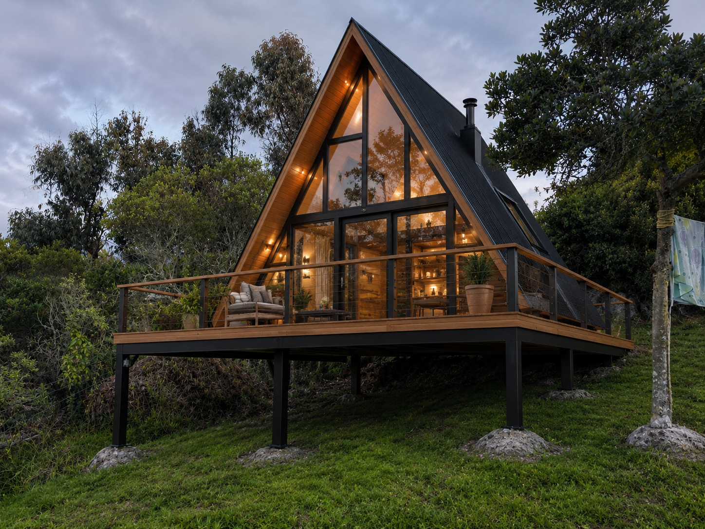
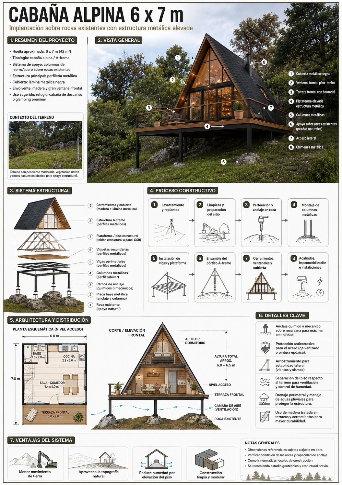

# Cabaña Alpina — Construcción Open Source

Cabaña tipo A-frame de 6 × 7 m elevada sobre plataforma de acero, apoyada en peñas de roca existentes. Liberada en open source desde M0 para que cualquiera pueda hacer fork del diseño, del listado de materiales y de la bitácora de obra.

## Estado

**M0 — Especificación + BOM preliminar.** Dimensiones y cantidades son de primera pasada y están marcadas explícitamente como preliminares. Perfiles, anclajes, soldaduras y arriostramientos finales deben ser validados por un ingeniero estructural matriculado, después de un estudio geotécnico del sitio (calidad de roca, pendiente, viento, sismicidad).

## Qué hay en este repo

| Archivo | Propósito |
|---|---|
| [`SPEC.md`](SPEC.md) | Especificación dimensional + sistema (plataforma, A-frame, envolvente) |
| [`BOM.md`](BOM.md) | Listado preliminar de materiales — acero estructural, envolvente, fijaciones, acabados |
| [`docs/SITE.md`](docs/SITE.md) | Contexto del sitio — terreno, peñas de roca, vegetación, pendiente |
| [`docs/REFERENCE.md`](docs/REFERENCE.md) | Intención de diseño + decisiones críticas para el ingeniero |
| [`docs/NOTES.md`](docs/NOTES.md) | Preguntas abiertas, bitácora de decisiones, hitos |
| [`assets/reference/`](assets/reference/) | Foto cabaña de referencia, foto del sitio, infografía del sistema |

## Concepto

- **Huella**: plataforma elevada 6.0 × 7.0 m (42 m²)
- **Cabaña cerrada**: ~6.0 × 5.0 m (30 m²)
- **Terraza frontal**: 6.0 × 2.0 m (12 m²)
- **Cubierta**: A-frame, ápice ~6.2 m, lámina metálica negra tipo standing seam
- **Apoyo**: 9 columnas metálicas (malla 3 × 3) ancladas a peñas existentes
- **Estructura**: plataforma metálica + pórticos A-frame cada ~1.0 m
- **Envolvente**: ventanal frontal piso-techo, gable trasero en madera tratada, cielo raso interior en machimbre

El sistema reutiliza las peñas de roca naturales del sitio como cimentación — mínimo movimiento de tierra, mínimo concreto. Ver la infografía del sistema:

## Licencia

- **Planos, dibujos, documentación, BOM** — [Creative Commons Atribución-CompartirIgual 4.0](LICENSE) (CC-BY-SA-4.0)
- **Scripts / herramientas futuras** — Apache-2.0 (se agregarán bajo `tools/` con un `LICENSE-CODE` separado cuando aparezcan)

Eres libre de usar, hacer fork, modificar y construir a partir de estos planos. Si publicas derivados, compártelos bajo la misma licencia y dale crédito a `broomva/alpine-cabin`.

## Aviso de ingeniería

Nada en este repositorio sustituye planos firmados por un ingeniero matriculado, un estudio geotécnico ni una licencia de construcción que cumpla la normativa local. Quien construya a partir de estos documentos lo hace bajo su propio riesgo y debe contratar profesionales licenciados (ingeniero estructural, ingeniero geotécnico, autoridad de construcción local) antes de empezar la obra. El autor no asume ninguna responsabilidad por estructuras construidas a partir de estos documentos.

## Contribuciones

Issues y PRs bienvenidos. Si quieres proponer un cambio de diseño, abre primero un issue para que la discusión quede buscable.

## Procedencia del proyecto

Iniciado bajo la disciplina [bstack](https://github.com/broomva/bstack) en `~/broomva/builds/alpine-cabin/`. Ver [`CLAUDE.md`](CLAUDE.md) para el contrato de gobernanza que aplica a ediciones hechas por agentes en este repo.
