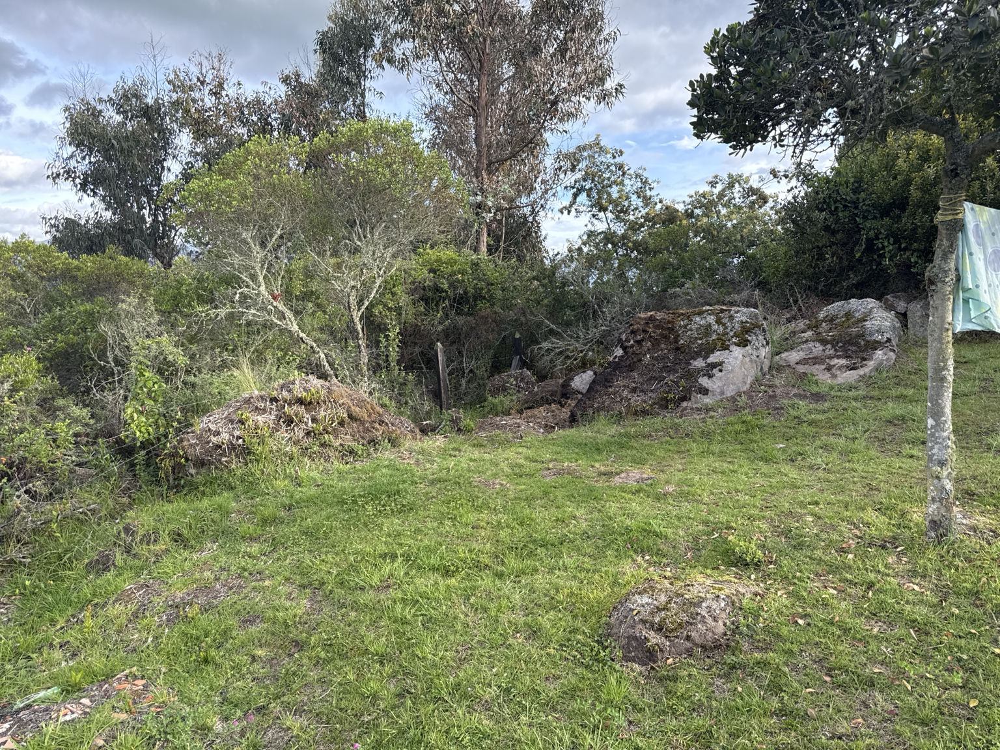

# SITIO — Contexto del terreno

Estado: **M0 — reconocimiento visual únicamente.** Sin levantamiento topográfico, sin estudio geotécnico, sin coordenadas GPS aún.

## Observaciones a partir de la foto del sitio

- **Pendiente**: moderada, descendiendo desde las rocas superiores hacia la franja de césped en primer plano.
- **Vegetación**: arbustos nativos, eucalipto, especies leñosas mezcladas. Ya hay zona despejada — el área limpia en primer plano es la huella candidata para la plataforma.
- **Rocas**: al menos 4–5 peñas grandes visibles:
  - Dos peñas apiladas en la esquina superior derecha (el cúmulo más grande — probable candidata para la línea de columnas aguas arriba).
  - Una peña a media imagen parcialmente expuesta (candidata para un apoyo intermedio).
  - Una peña pequeña en primer plano inferior derecho.
  - Una peña en primer plano inferior izquierdo (parcial).
- **Material orgánico**: montón de material orgánico visible al frente izquierdo — debe retirarse antes del levantamiento.
- **Elementos existentes**: poste de madera envuelto en cuerda/tela al borde derecho (marcador de servicio o linderos).

## Lo que aún no sabemos

| Incógnita | Cómo resolverla |
|---|---|
| Coordenadas GPS exactas | Visita a sitio + GPS de mano o celular |
| Elevación sobre nivel del mar | GPS / mapa topográfico |
| Ángulo y dirección de pendiente | Levantamiento topográfico |
| Dirección predominante del viento | Datos meteo locales / observación de sitio multi-día |
| Clasificación de zona sísmica | Consulta normativa local |
| Tipo de roca (ígnea, metamórfica, meteorizada) | Muestra geotécnica / consulta litológica |
| Continuidad de la roca (maciza vs. fracturada) | Visual + prueba acústica (sonido al golpear con martillo) |
| Capacidad portante de la roca | Ensayo geotécnico de compresión |
| Suelo entre rocas (orgánico, arcilla, arena) | Apique de prueba |
| Ruta de drenaje | Caminata de sitio durante un evento de lluvia |
| Recorrido solar (para orientación del ventanal frontal) | Brújula + verificación según estación |
| Vía de acceso para entrega de material | Caminata de sitio + medir gálibo para acceso de camión con acero |
| Fuente de agua | Encuesta de sitio / informe de pozo / conexión municipal |
| Servicio eléctrico | Distancia a la red / candidato a solar off-grid |
| Jurisdicción de licencia de construcción | Consulta catastral local |
| Distancias de aislamiento / linderos | Levantamiento catastral |

## Decisiones críticas bloqueadas por el levantamiento de sitio

1. **Alturas exactas de columna** — hasta que tengamos elevaciones topográficas en cada una de las 9 posiciones de columna, las estimaciones de longitud de columna en el BOM son aproximadas.
2. **Ubicación de anclajes** — ¿qué rocas realmente sostienen anclajes? Algunas peñas visibles pueden estar sobre suelo blando y no servir.
3. **Orientación frontal** — el A-frame debe apuntar a la mejor vista Y la menor exposición al viento Y evitar sobrecalentar el vidrio con sol de la tarde. Estos tres pueden entrar en conflicto.
4. **Trazado de drenajes** — los drenajes perimetrales deben sacar el agua lejos de los puntos de anclaje; necesitamos saber por dónde corre el agua naturalmente.

## Checklist de obra previa al sitio

- [ ] Levantamiento topográfico (9 posiciones de columna + perímetro)
- [ ] Estudio geotécnico / muestra de roca en cada punto de anclaje candidato
- [ ] Retirar material orgánico de la huella de la plataforma
- [ ] Marcar posiciones de columna sobre las rocas con pintura
- [ ] Maqueta in situ con estacas y cuerda a tamaño real 6 × 7 m
- [ ] Fotografiar la maqueta desde los 4 puntos cardinales
- [ ] Revisión de normativa local y trámite de licencia
- [ ] Confirmar ruta de acceso para entrega de material
